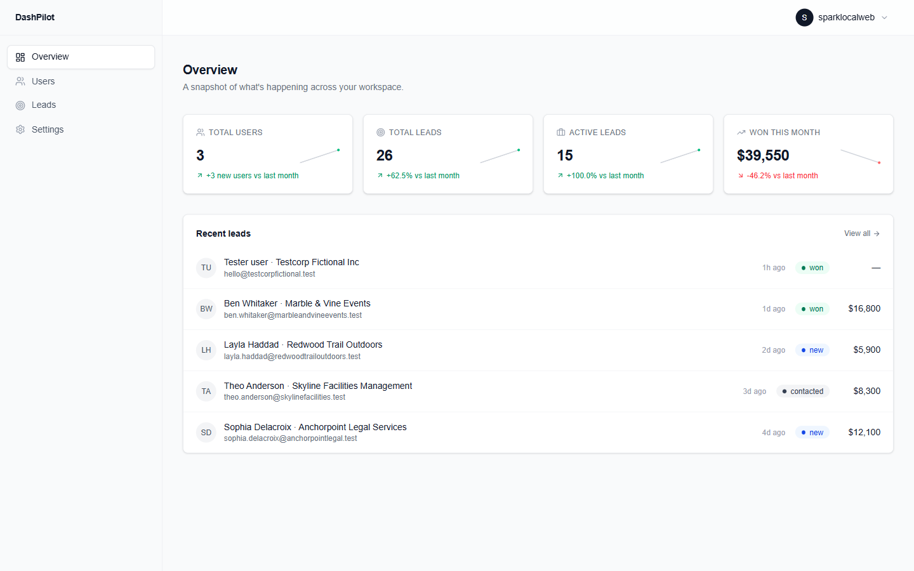
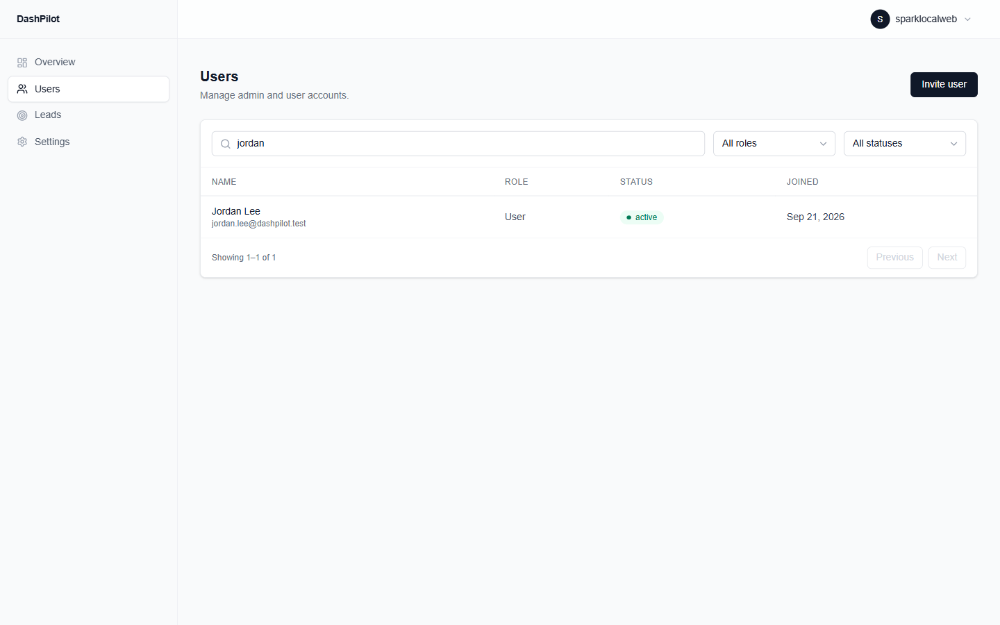
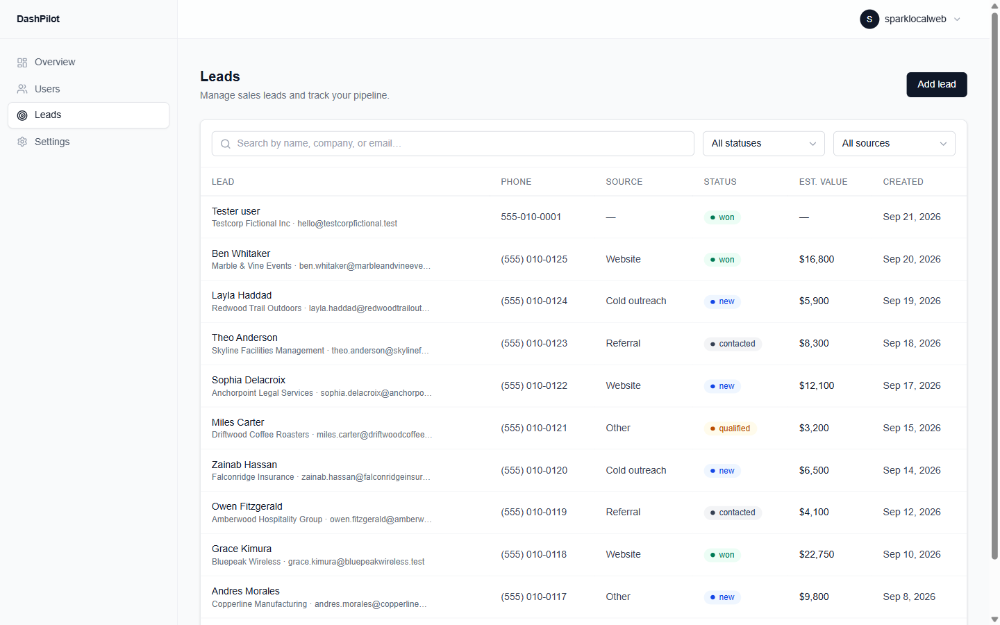
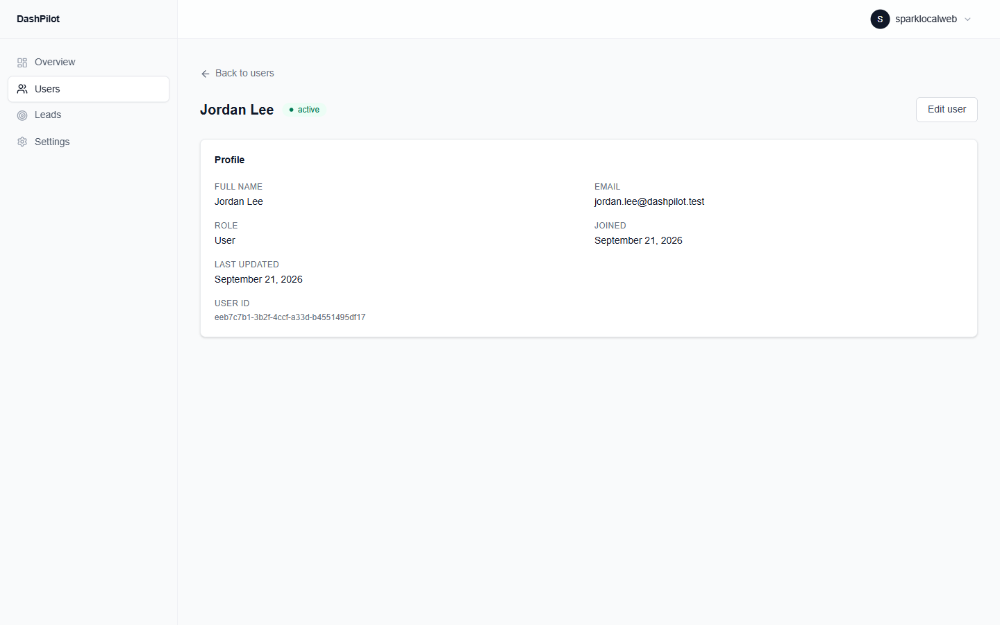
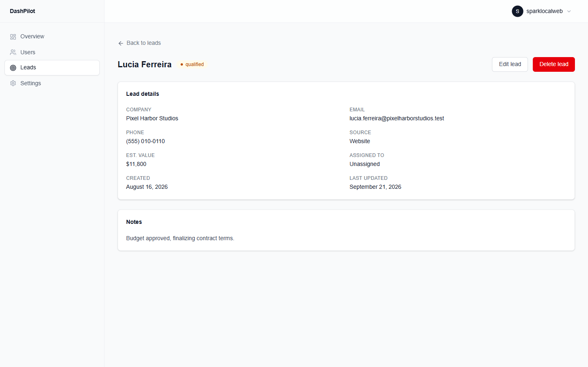

# DashPilot

A full-stack, CRM-style admin dashboard built to demonstrate production-quality
full-stack engineering: authentication, authorization, relational schema
design, row-level security, server-side validation, and a responsive,
accessible UI — end to end, on a real database.

## Overview

DashPilot simulates a realistic SaaS admin panel for a small B2B sales
operation. An authenticated admin manages platform users and sales leads,
reviews summary statistics, and works with data through search, filtering,
and pagination, all in a clean, professional interface.

**Who it's for:** prospective freelance/contract clients (Upwork and similar)
evaluating whether a developer can ship a real, cohesive product — not a
tutorial clone stitched together from a boilerplate.

**What it demonstrates:** the parts of full-stack work that are easy to skip
in a demo and hard to get right in practice — authorization that holds up
even if application code has a bug (enforced at the database via Postgres
Row Level Security, not just in the UI), a secure invite-and-onboarding flow
that never exposes a privileged key to the browser, self-lockout protection
for admins, and a polish pass covering loading/empty/error states,
accessibility, and responsive layout — not just a list and a form.

## Key Features

- **Admin authentication** — email/password login via Supabase Auth, with
  server-side session handling and route protection.
- **Active-admin authorization** — a second, independent check (beyond
  "is there a session") verifies the caller is an admin *and* currently
  active before granting access to the dashboard.
- **Secure user invitations** — admins invite new users by email via the
  Supabase Auth Admin API, gated by an application-layer authorization check
  that runs before the privileged admin client is ever touched.
- **Invite onboarding / password setup** — a dedicated flow takes an invited
  user from clicking the email link to a working password to a normal login,
  handling all three token formats Supabase's invite link can arrive in.
- **Real Supabase user management** — list, search, filter, and edit real
  `profiles` rows; no demo/mock data in the users flow.
- **Search, filters, and pagination** — server-side, URL-driven (so state
  survives reload/back-forward and is shareable) across both Users and
  Leads.
- **Lead CRUD** — full create/read/update/delete against real Supabase data,
  with server-side validation.
- **Lead assignment** — leads can be assigned to active admins, distinct
  from the platform users the dashboard manages.
- **Dashboard statistics** — real, computed-on-read aggregates (total users,
  total leads, active leads, won-this-month) with period-over-period trend
  comparisons.
- **Recent leads** — a live, newest-first feed on the Overview page.
- **Responsive design** — verified at mobile, tablet, and desktop widths,
  including the navigation, tables, and dialogs.
- **Loading / empty / error states** — every data-backed view has a
  skeleton loading state, a natural (non-developer-facing) empty state, and
  a generic, non-leaking error state with server-side logging.
- **Accessibility improvements** — accessible dialog names, keyboard-safe
  forms (Enter doesn't accidentally submit), managed focus on the mobile
  navigation, semantic heading structure, and labeled table headers.
- **Row Level Security and server-side security** — authorization is
  enforced at the database layer via PostgreSQL RLS, not just in application
  code, so access rules hold even if a query bypasses the app layer.

## Tech Stack

- **Framework:** [Next.js](https://nextjs.org/) (App Router)
- **Language:** TypeScript
- **Styling:** [Tailwind CSS](https://tailwindcss.com/)
- **Auth:** Supabase Auth
- **Database:** PostgreSQL (via [Supabase](https://supabase.com/))
- **Authorization:** Supabase Row Level Security (RLS)
- **Validation:** [Zod](https://zod.dev/)
- **Testing:** Playwright MCP (browser-driven manual/exploratory QA across
  every feature and viewport)
- **Deployment (planned):** Vercel

## Architecture

**Rendering model.** Next.js App Router with React Server Components by
default. Pages that only read data (dashboard overview, user/lead lists,
detail views) render on the server and query Supabase directly — no
separate REST/GraphQL layer in between. Interactive pieces (forms, filters,
dialogs, edit-mode toggles) are isolated as small Client Components.

**Data flow.** Reads happen directly in Server Components via a
server-side Supabase client. Writes (create/update/delete on users and
leads) go through Next.js Server Actions, which validate input with Zod
before touching the database. Browser-only interactions (e.g., the
invite-acceptance token exchange) use a browser Supabase client.

**Three Supabase clients, three trust levels:**
- A **browser** client for client-side auth interactions.
- A **server** client (cookie-based session) used by Server Components and
  Server Actions — this is what almost everything in the app uses, and it's
  fully subject to RLS.
- A **server-only admin client**, gated at build time by the `server-only`
  package so it can never be imported into a Client Component, used in
  exactly one place (the invite flow) to call the Supabase Auth Admin API.
  It bypasses RLS entirely, so every caller is required to pass an
  independent, session-scoped active-admin check *before* this client is
  ever constructed — the privileged key itself grants no authorization on
  its own.

**Database schema.** Two core tables: `profiles` (one row per authenticated
user — admins and managed platform users alike, distinguished by `role`)
and `leads` (sales/prospect records, optionally assigned to an admin via a
foreign key back to `profiles`). A trigger (`handle_new_user`) creates the
matching `profiles` row automatically whenever Supabase Auth creates a new
`auth.users` row, hardcoding `role`/`status` to `user`/`active` — no
signup path, including invites, can ever hand itself an elevated role.

**Row Level Security.** RLS is enabled on both tables. A user can read and
update only their own profile (with the columns they can touch narrowed by
a trigger); admins can read/update every profile; leads are admin-only,
end to end. A `SECURITY DEFINER` helper (`is_admin()`) checks the caller's
own role and active status without recursively re-triggering RLS on
`profiles`.

**Server-only secret usage.** The one operation that needs elevated
privilege — inviting a new user via the Auth Admin API — uses a
`SUPABASE_SECRET_KEY` that is read only inside a file guarded by the
`server-only` package, imported from exactly one server-side module, and
never logged. Authorization for that operation is checked separately,
against the normal session-scoped client, before the privileged client is
ever created.

## Security Highlights

- A normal (non-admin) user cannot reach the admin dashboard — even with a
  valid, authenticated session, the `(dashboard)` layout independently
  verifies `role === 'admin'` before rendering anything past the shell.
- An admin must currently be **active** to retain admin access — a
  disabled admin is treated as a normal user everywhere that matters,
  including on their own account.
- Users cannot self-promote — role and status are never taken from
  user-supplied signup or invite metadata; only the database trigger sets
  them, hardcoded.
- An active admin cannot demote their own role or disable their own
  account — an explicit application-layer guard blocks it (a gap that RLS
  alone can't close, due to how Postgres evaluates a policy against the
  pre-update row).
- The Supabase service-role secret key never leaves the server: it's
  imported from exactly one file, guarded by a build-time check
  (`server-only`) that fails the build if it's ever reachable from a Client
  Component.
- Authorization is enforced twice, independently: PostgreSQL Row Level
  Security at the database layer, and base table `GRANT`s that decide
  whether a role can even attempt an operation before RLS is evaluated.
- No secrets are committed to this repository — `.env.local` is gitignored,
  and `.env.example` documents variable *names* only, with empty values.

## Demo Data

The data visible in the deployed/demo instance of this project is entirely
**fictional**. Seeded leads use invented names, companies, and notes, with
email addresses on the `.test` top-level domain (permanently reserved by
IETF RFC 2606 to guarantee it never resolves to a real domain) and phone
numbers in the `555-01xx` block conventionally reserved for fictional use.
No real customer, company, or personal data is included anywhere in this
project or its seed data.

## Development

### Install

```bash
npm install
```

### Environment variables

Copy `.env.example` to `.env.local` and fill in real values from your own
Supabase project (never commit `.env.local`):

- `NEXT_PUBLIC_SUPABASE_URL`
- `NEXT_PUBLIC_SUPABASE_PUBLISHABLE_KEY`
- `NEXT_PUBLIC_APP_URL` (optional — the app's own public base URL, used to
  build the invite email's redirect link; defaults to `http://localhost:3000`
  if unset. Set this to your deployed domain in production, and allow-list
  `<that domain>/auth/callback` in Supabase's Redirect URLs.)
- `SUPABASE_SECRET_KEY` (server-only — required for the Invite User flow)

### Run locally

```bash
npm run dev
```

### Lint and build

```bash
npm run lint
npm run build
```

### Database migrations and seed data

Schema migrations live in `supabase/migrations/` and are the source of
truth for the database schema; apply them to your Supabase project via the
Supabase Dashboard's SQL Editor (or the Supabase CLI, if you have a
Postgres connection available) in filename order.

Fictional demo data lives in `supabase/seed.sql` — a single, idempotent
script (safe to re-run) that seeds sample leads. It does not create any
demo user accounts via SQL; see the notes at the bottom of that file for
the safe way to add one (through Supabase Auth itself — the Admin API's
`createUser`, never a direct SQL insert into `profiles`). One such fictional
demo user (`jordan.lee@dashpilot.test`) was created this way for the
screenshots below.

## Screenshots

All screenshots below use fictional demo data only — no real names,
emails, or account information (see [Demo Data](#demo-data)).

### Overview



### Users



### Leads



### User detail



### Lead detail



## Project Status

- **Phases 1–6 (Database & Auth Foundation through Polish Pass): complete.**
- **Phase 7A (Portfolio Demo Data): complete.**
- **Phase 7B (Portfolio Documentation): complete** — this README, including
  real screenshots.
- **Phase 7C (Production Deployment): in progress.** Code is
  production-ready (no hardcoded localhost URLs; the invite redirect uses
  `NEXT_PUBLIC_APP_URL`), but the app has not yet actually been deployed to
  Vercel against a production Supabase instance — see `PROJECT.md` for the
  detailed, phase-by-phase project history, the exact Supabase redirect URLs
  to add post-deployment, and remaining open questions.

## Portfolio Summary

DashPilot is a full-stack admin dashboard built to demonstrate
production-quality engineering, not just a working prototype: real
authentication and active-admin authorization, a secure invite-and-onboarding
flow that keeps privileged credentials server-only, full CRUD for users and
sales leads backed by PostgreSQL Row Level Security, and a UI that handles
loading, empty, and error states as first-class concerns rather than
afterthoughts. It's built with Next.js, TypeScript, Tailwind CSS, and
Supabase, and was developed with a deliberate emphasis on the details that
distinguish a shippable product from a tutorial clone — server-side
validation, accessibility, and responsive design across every screen.
